# Database2Code

You can download the extension from https://marketplace.visualstudio.com/items?itemName=ignatandrei.databasetocode

Modify the connectionDetails.txt and it will generate from you everything to WebAPI from SqlServer or Sqlite ( more providers soon). 
 
Also, it generates  different projects ( models, context, controllers, REACT CRA) – and you can also modify the templates. It works ( for the moment) just with tables with 0 or 1 PK.

# Steps to generate

1. Start a new project with DB2Code template
2. Modify the connection details from GeneratorPowershell
3. Run the project and it will generate the code for you
   1. If it shows an error , please copy the powershell command and run it from the terminal ( easy way: put into file a.bat)
4. The code will be generated - run the WebAPI project ( modify connection string if you want )
   1. If you want to use the REACT CRA, run the npm install and npm start
5. Modify the templates if you want to change something 

## How It works

```mermaid
flowchart TD
     

subgraph GRPWSH["technical Generate Powershell"]
    Run-->CDet("Read ConnectionDetails.txt")
    CDet--> PWSH("start powershell with each connection details" )
    PWSH --> Rep("Replace templates in GeneratorCRA")
    Rep --> RunScaf(" run scaffold for each template")
    
    
end
subgraph MainFlow
    new(install https://marketplace.visualstudio.com/items?itemName=ignatandrei.databasetocode  )
     u("You")
     Edit("Edit DB Connection String ")
     vsPWS("Run GeneratePowershell project")
     cPs1("Manual Run createPS1 with args shown")
     CRA( run http://localhost:3001  )
     Swagger(Check http://localhost:5018/BlocklyAutomation , http://localhost:5018/swagger)
     Do[Check Models, Context, Controllers, API project]
     u-- Run Visual Studio --> new     
     new -- New Solution from from DB2Code template--->Edit
     Edit-- Go to Powershell Project ConnectionDetail.txt , WebAPI appSettings.json --->vsPWS     
     vsPWS-- Wait fa:fa-spinner-->N{Run OK ?}
     N -->|No| cPs1
     
     cPs1-->NManual{ Has Error ?}
     NManual -->|Yes| Solve
     Solve --> cPs1
     NManual -->|No!| Edit
     N -->|YES!| Do
     subgraph Happy Path
     Do-- Run WebAPI project   --> Swagger
     Swagger-- Run CRA projet  --> CRA( run http://localhost:3001  )
     CRA --> End(end)
     end 
end     

```

